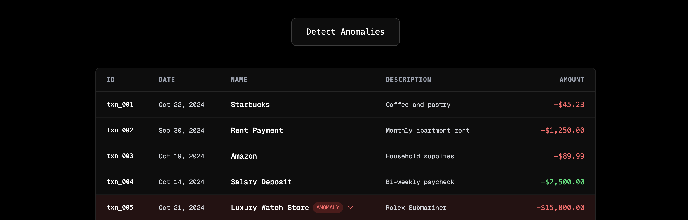

<p align="center">
  
</p>

<a href="https://reinvent-agent.vercel.app/">
  <h1 align="center">re:Invent Demo Agent</h1>
</a>

<p align="center">
    re:Invent Agent is an open-source example ToolLoopAgent built with Next.js and AI SDK.
</p>

<p align="center">
  <a href="#getting-started"><strong>Get Started</strong></a> ·
  <a href="https://ai-sdk.dev/"><strong>AI SDK</strong></a> ·
  <a href="https://useworkflow.dev/docs/getting-started"><strong>Workflow Development Kit</strong></a>
</p>
<br/>

## Getting Started

### Development mode
```bash
pnpm install
pnpm dev
```

Open [http://localhost:3000](http://localhost:3000) with your browser to see the result.

You can start editing the page by modifying `app/page.tsx`. The page auto-updates as you edit the file.

### Production mode

```bash
pnpm install
pnpm build
pnpm start
```

Your app should be up and running on [http://localhost:3000](http://localhost:3000)!


## Learn More

To learn more about Next.js, take a look at the following resources:

- [Next.js Documentation](https://nextjs.org/docs) — learn about Next.js features and API.
- [Learn Next.js](https://nextjs.org/learn) — an interactive Next.js tutorial.

You can check out [the Next.js GitHub repository](https://github.com/vercel/next.js/) — your feedback and contributions are welcome!
